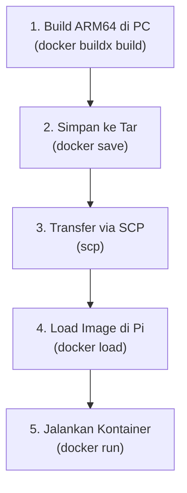

# Panduan Deployment ke Single Board Computer (SBC) - Raspberry Pi (ARM64)

Dokumen ini menjelaskan langkah-langkah lengkap untuk mem-build, mentransfer, dan menjalankan kontainer Docker VTOL (`sbc`) pada perangkat Raspberry Pi (atau Single Board Computer berbasis ARM64 lainnya) secara offline tanpa memerlukan login Docker Hub.

---

## Alur Kerja (Workflow)



---

## Langkah 1: Setup Environment Docker Buildx di PC/WSL

Agar PC Anda (x86_64) bisa membuat image untuk Raspberry Pi (ARM64), Anda perlu mengaktifkan emulator QEMU dan membuat builder khusus.

1. **Aktifkan Emulator QEMU:**
   ```bash
   docker run --privileged --rm tonistiigi/binfmt --install all
   ```

2. **Buat Builder Baru (Driver docker-container):**
   ```bash
   docker buildx create --name vtol_builder --use
   ```

3. **Bootstrap/Inisialisasi Builder:**
   ```bash
   docker buildx inspect --bootstrap
   ```

4. **Verifikasi Setup:**
   ```bash
   docker buildx ls
   ```
   *Pastikan `linux/arm64` terdaftar di bawah platform yang didukung.*

---

## Langkah 2: Build Image ARM64 di PC

Gunakan perintah Buildx untuk mem-build target `sbc` (ROS2 Base) secara spesifik dan memuatnya ke repositori Docker lokal PC Anda:

```bash
docker buildx build --platform linux/arm64 --target sbc -t vtol_sbc:arm64 --load .
```

---

## Langkah 3: Ekspor Image ke File Tar

Ubah image Docker lokal yang baru saja di-build menjadi file arsip `.tar`:

```bash
docker save -o vtol_sbc_arm64.tar vtol_sbc:arm64
```
*File `vtol_sbc_arm64.tar` akan muncul di folder Anda saat ini.*

---

## Langkah 4: Transfer File Tar ke Raspberry Pi (SCP)

Kirim file tersebut ke Raspberry Pi melalui jaringan lokal menggunakan `scp`. 
Ganti `pi` dengan username Pi Anda dan `192.168.x.x` dengan IP Raspberry Pi Anda:

```bash
scp vtol_sbc_arm64.tar pi@192.168.x.x:/home/pi/
```

## Langkah 5: Persiapan & Impor Image di Raspberry Pi

Untuk menjalankan kontainer di Raspberry Pi, Anda perlu mengimpor image dan melakukan clone repositori agar mendapatkan file `docker-compose.yml` serta folder `workspace`.

1. **Clone Repositori di Raspberry Pi:**
   Hubungkan Raspberry Pi ke internet, lalu clone repositori VTOL ini:
   ```bash
   git clone https://github.com/IPB-Robotic-Club/vtol_ros2.git ~/vtol_dev
   cd ~/vtol_dev
   ```

2. **Impor File Image (.tar):**
   Gunakan perintah `docker load` untuk mengimpor file tar yang telah ditransfer sebelumnya:
   ```bash
   docker load -i /home/pi/vtol_sbc_arm64.tar
   ```

3. **Verifikasi Image:**
   Pastikan image `vtol_sbc:arm64` sudah berhasil terdaftar di sistem Docker Raspberry Pi Anda:
   ```bash
   docker images
   ```

---

## Langkah 6: Jalankan Kontainer di Raspberry Pi

Setelah repositori di-clone dan image berhasil diimpor, Anda siap menjalankan kontainernya.

1. **Jalankan Kontainer Menggunakan Docker Compose:**
   Masuk ke folder repositori yang telah di-clone, lalu jalankan target `sbc`:
   ```bash
   cd ~/vtol_dev
   docker compose up -d sbc
   ```
   *(Penting: pastikan tidak menggunakan flag `-t` agar syntax tidak error, cukup gunakan `sbc` untuk menargetkan service).*

2. **Masuk ke Lingkungan Kontainer:**
   Gunakan perintah berikut untuk masuk ke dalam shell kontainer yang sedang berjalan:
   ```bash
   docker exec -it vtol_sbc bash
   ```
   *(Kini Anda siap menjalankan node ROS2 atau aplikasi drone Anda secara langsung di dalam kontainer Raspberry Pi!)*
