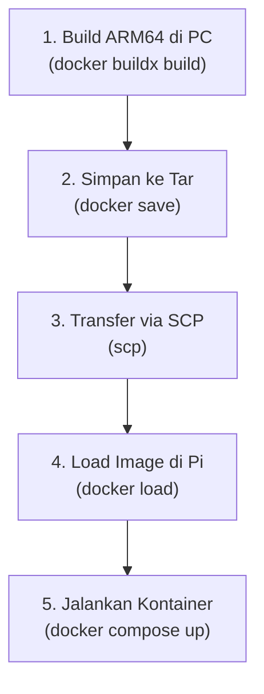

# Panduan Deployment ke Single Board Computer (SBC) - Raspberry Pi (ARM64)

Dokumen ini menjelaskan langkah-langkah lengkap untuk mem-build, mentransfer, dan menjalankan kontainer Docker VTOL (`sbc`) pada perangkat Raspberry Pi secara offline tanpa memerlukan login Docker Hub.

---

## Daftar Isi
- [BAGIAN I: SETUP AWAL (Hanya Sekali Setup)](#bagian-i-setup-awal-hanya-sekali-setup)
  - [1. Konfigurasi Docker Buildx di PC/WSL](#1-konfigurasi-docker-buildx-di-pcwsl)
  - [2. Clone Repositori di Raspberry Pi](#2-clone-repositori-di-raspberry-pi)
- [BAGIAN II: ALUR HARIAN / SETIAP UPDATE (Daily Workflow)](#bagian-ii-alur-harian--setiap-update-daily-workflow)
  - [1. Build Image ARM64 di PC](#1-build-image-arm64-di-pc)
  - [2. Ekspor Image ke File Tar](#2-ekspor-image-ke-file-tar)
  - [3. Transfer File Tar ke Raspberry Pi (SCP)](#3-transfer-file-tar-ke-raspberry-pi-scp)
  - [4. Impor & Jalankan di Raspberry Pi](#4-impor--jalankan-di-raspberry-pi)

---

## BAGIAN I: SETUP AWAL (Hanya Sekali Setup)

Bagian ini hanya perlu dijalankan sekali saat pertama kali menyiapkan lingkungan pengembangan Anda.

### 1. Konfigurasi Docker Buildx di PC/WSL
Agar PC Anda (x86_64) bisa membuat image untuk Raspberry Pi (ARM64), Anda perlu mengaktifkan emulator QEMU dan membuat builder khusus.

1. **Aktifkan Emulator QEMU:**
   ```bash
   docker run --privileged --rm tonistiigi/binfmt --install all
   ```

2. **Buat Builder Baru (Driver docker-container):**
   ```bash
   docker buildx create --name vtol_builder --use
   ```

3. **Bootstrap/Inisialisasi Builder:**
   ```bash
   docker buildx inspect --bootstrap
   ```

4. **Verifikasi Setup:**
   ```bash
   docker buildx ls
   ```
   *Pastikan `linux/arm64` terdaftar di bawah platform yang didukung.*

### 2. Clone Repositori di Raspberry Pi
Hubungkan Raspberry Pi ke internet untuk pertama kali, lalu unduh repositori ini untuk mendapatkan folder `workspace` dan file `docker-compose.yml`:
```bash
git clone https://github.com/IPB-Robotic-Club/vtol_ros2.git ~/vtol_dev
cd ~/vtol_dev
```

---

## BAGIAN II: ALUR HARIAN / SETIAP UPDATE (Daily Workflow)

Ikuti alur ini setiap kali Anda mengubah kode program di PC dan ingin menerapkannya (deploy) ke Raspberry Pi.



### 1. Build Image ARM64 di PC
Jalankan perintah buildx untuk mem-build target `sbc` secara spesifik untuk arsitektur ARM64 dan memuatnya ke docker lokal PC Anda:
```bash
docker buildx build --platform linux/arm64 --target sbc -t vtol_sbc:arm64 --load .
```

### 2. Ekspor Image ke File Tar
Ubah image lokal tersebut menjadi file arsip `.tar` agar bisa dipindahkan:
```bash
docker save -o vtol_sbc_arm64.tar vtol_sbc:arm64
```

### 3. Transfer File Tar ke Raspberry Pi (SCP)
Kirim file tar tersebut ke Raspberry Pi menggunakan jaringan lokal. Ganti `pi` dengan username dan `192.168.x.x` dengan IP Raspberry Pi Anda:
```bash
scp vtol_sbc_arm64.tar pi@192.168.x.x:/home/pi/
```

### 4. Impor & Jalankan di Raspberry Pi
Buka terminal Raspberry Pi Anda (misal via SSH), lalu ikuti perintah berikut:

1. **Load Image dari File Tar:**
   ```bash
   docker load -i /home/pi/vtol_sbc_arm64.tar
   ```

2. **Masuk ke Direktori Repositori:**
   ```bash
   cd ~/vtol_dev
   ```

3. **Jalankan Kontainer Target SBC:**
   ```bash
   docker compose up -d sbc
   ```
   *(Penting: pastikan tidak menggunakan flag `-t` agar syntax tidak error).*

4. **Masuk ke Lingkungan Kontainer:**
   ```bash
   docker exec -it vtol_sbc bash
   ```
   *(Anda kini berada di dalam kontainer dan siap menjalankan node ROS2 atau program penerbangan drone).*
